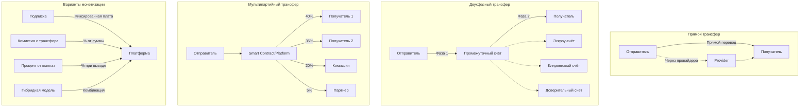

# Жизненный цикл транзакций

*← Назад к [[README]]*

#транзакция #жизненный-цикл #процесс #платформа

## Участники процесса

В процессе проведения трансферов активов через платформу-посредника кроме субъектов трансфера принимают участие 3 стороны:
- участник [[Participant]]
- платформа [[Platform]]
- провайдер [[Provider]]

## Варианты движения активов

Возможны различные варианты движения активов, но все они основаны на владении/управлении счётом, на который поступают активы отправителя. 

### Примеры счетов
- эскроу-счёт (владелец провайдер, но платформа может делать с него трансферы/возвраты)
- счёт участника с доверительным управлением платформой
- клиринговый счёт платформы

### Двухфазный процесс

Если для расчётов используется промежуточный счёт (то есть не счёт конечного получателя), то полный путь движения активов как правило состоит из двух трансферов:
1. Трансфер активов отправителя на промежуточный счёт
2. Трансфер активов с промежуточного счёта на счёт получателя

При этом такие трансферы могут производится как по расписанию, так и по требованию (в зависимости от условий обслуживания).

## Диаграмма жизненного цикла

## Способы монетизации

Способы монетизации платформы так же могут использоваться разные:
- подписка (участник платит непосредственно платформе, активы сразу поступают на расчётный счёт платформы)
- комиссия с трансфера, которая снимается с отправителя до отправки активов на промежуточный счёт
- процент от выплат участникам с промежуточного счёта
- т.п. и различные комбинации

---

## Связанные концепции

- **[[Transfer]]** — базовая единица в жизненном цикле
- **[[Platform]]** — что управляет жизненным циклом
- **[[Participant]]** — кто инициирует жизненный цикл
- **[[Provider]]** — где реально выполняется жизненный цикл
- **[[Asset]]** — что движется в жизненном цикле

*См. также: [[README#Терминология проекта]]*