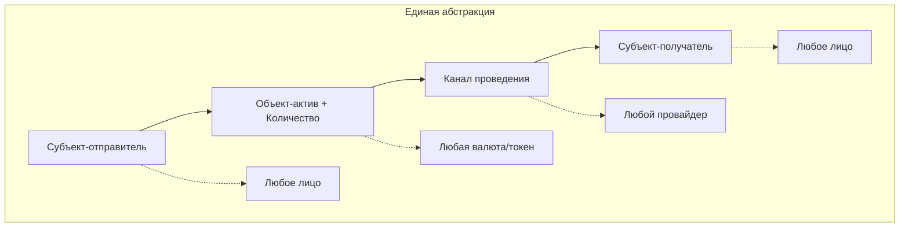

# Трансфер активов

*← Назад к [[README]]*

#трансфер #операция #перемещение

## Обобщённое определение

**Трансфер активов** – это процесс перемещения финансовых инструментов (фиатные деньги, криптовалюта и др.) между счетами, кошельками и т.п. в рамках банковских, инвестиционных или платежных систем, при этом владельцем счёта, кошелька могут быть юр.лица и физ.лица. Трансфер является минимальным "кирпичиком" финансовых транзакций, которые могут состоять из последовательности трансферов (см. [[Transaction Lifecycle]])

## Основные свойства
1. Субъекты трансфера - отправитель и получатель
2. Форма активов и количество - фиатные деньги, криптовалюты [[Asset]]
3. Канал проведения [[Provider]] - банк, P2P-платформа, инвестиционная платформа (биржа)
4. Назначение/тип трансфера - оплата, выплата, ввод, вывод, перевод, погашение долгов 

## Примеры применения абстракции

Универсальность концепции трансфера позволяет описать любые финансовые операции через единую модель:

## Технические особенности

**Примечания:**
- формат описания субъектов трансфера зависит от канала проведения и может быть различным (банковские реквизиты, карточные реквизиты, номер телефона привязанный к счёту, адрес криптокошелька и т.д.);
- часто один из субъектов трансфера идентифицируется непосредственно по каналу проведения, например, банк выдает платёжной платформе ключ авторизации, который она должна использовать при проведении операций и таким образом банковская система автоматически определяет/подставляет реквизиты самой платформы (второй субъект передается явно в формате, определённом соответствующим API провайдера)

---

## Связанные концепции

- **[[Asset]]** — что передается в трансфере
- **[[Participant]]** — кто участвует в трансфере
- **[[Provider]]** — через что проводится трансфер  
- **[[Transaction Lifecycle]]** — как трансферы объединяются в транзакции
- **[[Platform]]** — что оркестрирует трансферы

*См. также: [[README#Терминология проекта]]*

---

> **Техническая заметка:** "Обобщённый трансфер" в таком виде выглядит как "универсальная сессия" для, например, hellgate, то есть очень тонкий слой от имеющегося процессинга