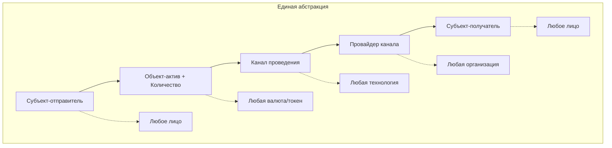

# Трансфер активов

*← Назад к [[README]]*

#трансфер #операция #перемещение

## Обобщённое определение

**Трансфер активов** – это процесс перемещения финансовых инструментов (фиатные деньги, криптовалюта и др.) между счетами, кошельками и т.п. в рамках банковских, инвестиционных или платежных систем, при этом владельцем счёта, кошелька могут быть юр.лица и физ.лица. Трансфер является минимальным "кирпичиком" финансовых транзакций, которые могут состоять из последовательности трансферов (см. [[Transaction Lifecycle]])

## Основные свойства
1. **Субъекты трансфера** — отправитель и получатель [[Participant]]
2. **Актив и количество** — тип и объём передаваемых финансовых инструментов [[Asset]]
3. **Канал проведения** — технология передачи активов [[Channel]]
4. **Провайдер** — организация, реализующая канал [[Provider]]
5. **Назначение/тип трансфера** — оплата, выплата, ввод, вывод, перевод, погашение долгов

## Архитектура выбора канала и провайдера

Для каждого трансфера платформа должна определить оптимальный путь передачи активов:

```
Тип актива → Применимые каналы → Доступные провайдеры → Выбор оптимального
```

### Факторы выбора:
- **Поддержка актива** — канал должен поддерживать передаваемый тип актива
- **Географические ограничения** — канал должен работать в юрисдикциях участников
- **Скорость и стоимость** — оптимизация по времени и комиссиям
- **Лимиты операций** — соответствие лимитам канала и провайдера
- **Надёжность** — доступность и стабильность провайдера 

## Примеры применения абстракции

Универсальность концепции трансфера позволяет описать любые финансовые операции через единую модель:



## Технические особенности

**Примечания:**
- формат описания субъектов трансфера зависит от канала проведения и может быть различным (банковские реквизиты, карточные реквизиты, номер телефона привязанный к счёту, адрес криптокошелька и т.д.);
- часто один из субъектов трансфера идентифицируется непосредственно по каналу проведения, например, банк выдает платёжной платформе ключ авторизации, который она должна использовать при проведении операций и таким образом банковская система автоматически определяет/подставляет реквизиты самой платформы (второй субъект передается явно в формате, определённом соответствующим API провайдера)

---

## Связанные концепции

- **[[Asset]]** — что передается в трансфере
- **[[Participant]]** — кто участвует в трансфере
- **[[Channel]]** — по какой технологии проводится трансфер
- **[[Provider]]** — кто реализует канал проведения трансфера  
- **[[Transaction Lifecycle]]** — как трансферы объединяются в транзакции
- **[[Platform]]** — что оркестрирует выбор каналов и провайдеров

*См. также: [[README#Терминология проекта]]*

---

> **Техническая заметка:** "Обобщённый трансфер" в таком виде выглядит как "универсальная сессия" для, например, hellgate, то есть очень тонкий слой от имеющегося процессинга